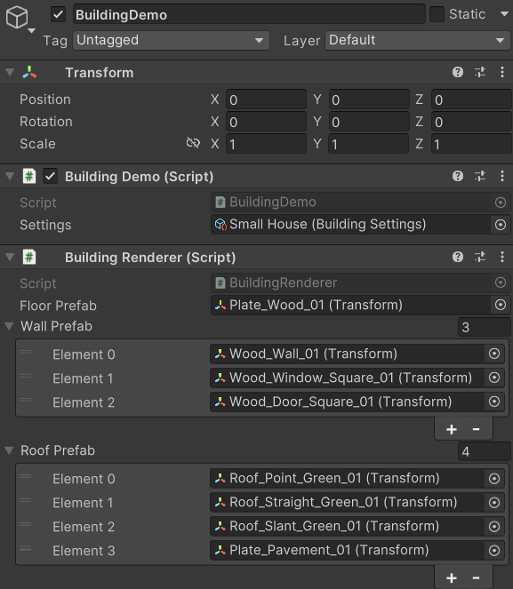
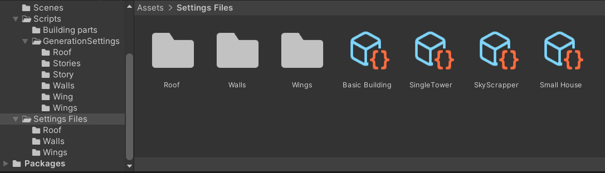
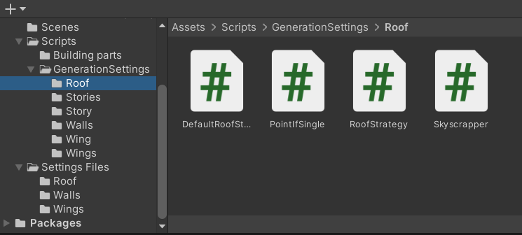
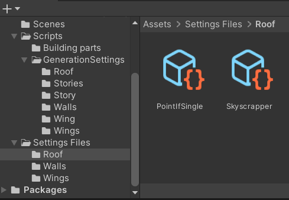

# ProceduralBuilding
Univ project for building procedural generation

The building Grammar
=============
The project is based on the following grammar.\
The terms in "<>" are called non-terminal and can produce new things while terminal terms only have a few possibilities and then are set
The terms <Wings> and <Stories> are a bit special since they can produce either a single <Wing> or <Story> but can also produce another <Wings> or <Stories> that will then repeat the cycle.

Setting up the demo
=============
Select the BuildingDemo object in the scene and put a building Setting file inside "settings" to specify the type of building that you want.\
You can also specify the types of prefabs you want to use to render this building below

Creating new settings files
=============
To create a new settings file for a specific type of building you need to go to the "Settings Files" folder and then do Right Click/Create/Building Generation/Building Settings and then you can specify all the different variables and strategies you want your building type to answer to.

Creating new strategies
=============
First you need to create a new C# script in the corresponding folder to the part you want to add a strategy to.\
This new class must inherit from the abstract strategy class, in this case RoofStrategy and then override the Generate method with the new strategy you want to implement inside.\
You also need to make a new AssetMenu on top of the class.\
For example in the PointIfSingle strategy this line looks like this "[CreateAssetMenu(menuName = "Building Generation/Roof/Point If Single")]"

Then you will need to create a ScriptableObject, you need to do a right click/Create/Building Generation Then select the type of element you just wrote a strategy for and create a object of that strategy.\
You can then go back to your settings file and place the strategy in the corresponding element.\
Note: Since the DefaultStrategies are automatically selected if you do not specify one, their files are not created in thoses folders, everything is handled inside the code

